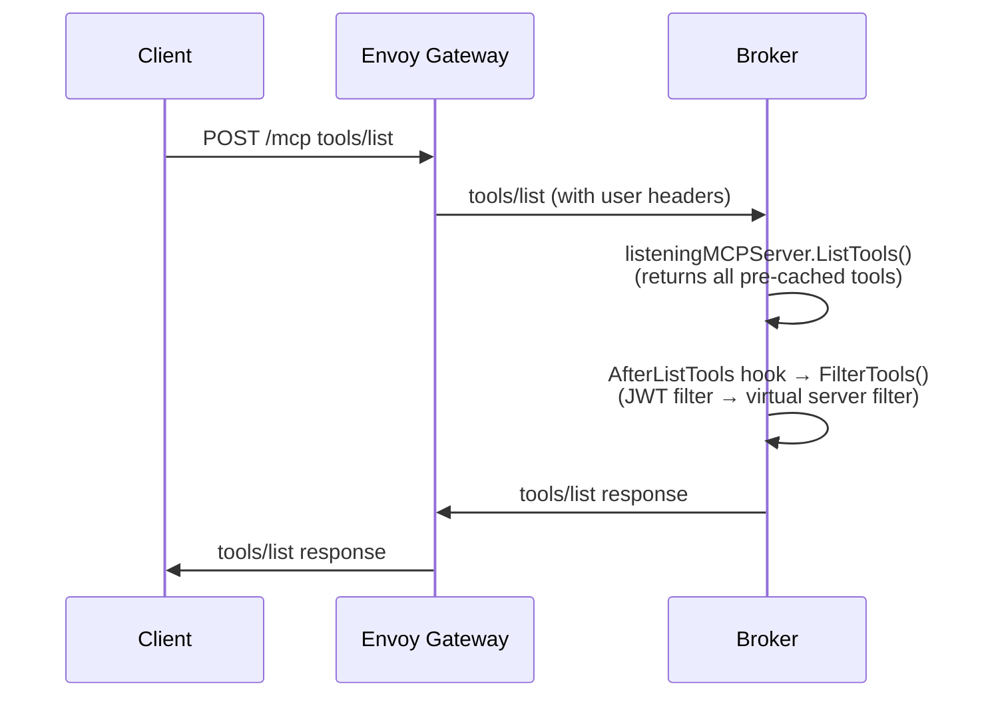
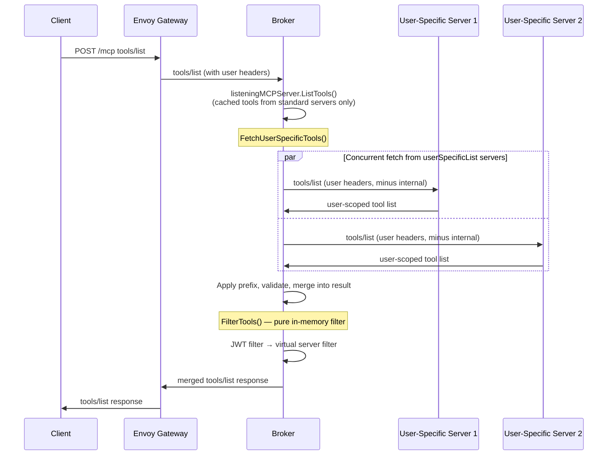

# User-Specific Tool Lists

**Issue**: [#255](https://github.com/Kuadrant/mcp-gateway/issues/255)
**Status**: Draft
**Milestone**: v0.7

## Problem

The broker aggregates tools from upstream MCP servers at startup using a service account credential and caches them. The `x-mcp-authorized` header can filter which cached tools a user sees, but this only works when the gateway already knows about all possible tools.

Some MCP servers return different tool sets per user based on their credentials. These tools may not exist in the broker's cached list — the service account may lack access, or the server may dynamically generate tools per user. The `x-mcp-authorized` filter can't expose tools the broker never discovered.

## Summary

Add an opt-in `userSpecificList` field to MCPServerRegistration. When enabled, the broker skips tool caching for that server and instead fetches tools live during each `tools/list` request using the user's session headers. Results are merged with cached tools from standard servers before applying existing filters.

## Goals

- Per-user tool discovery from upstream MCP servers that scope tools by credential
- Backward compatible — existing servers unaffected (defaults to `Disabled`)
- Graceful degradation — a failing user-specific server doesn't break the response
- Maintain lazy init for standard servers — fan-out only for opted-in userSpecificList servers

## Non-Goals

- Per-user prompt federation (future work, same pattern)
- Fan-out initialize at session start for standard servers (userSpecificList servers use init-on-first-list)
- Caching user-specific tool lists (stale invalidation complexity)
- Changes to tool/call routing (unchanged — router already handles per-server routing)

## Job Stories

### When an upstream scopes tools per user

When a platform engineer or MCP Developer configures an MCPServerRegistration for a shared MCP server (e.g. GitHub MCP) that returns different tools based on user credentials, they want to mark that server as user-specific, so that each user's `tools/list` reflects their actual upstream permissions rather than the service account's cached list.

### When a user discovers tools through the gateway

When a user sends `tools/list` and some upstream servers provide user-specific tools, they want to see the actual tools the upstream returns for their session merged with cached tools from standard servers, so that they can discover all available tools including those a specific service account may not have access to.


### When a developer tests changes against a user-specific server

When an MCP developer deploys or updates a `userSpecificList` server and calls `tools/list` through the gateway, they want the broker to fetch tools live from their server using the developer's own credentials, so that they can verify the correct tools appear for their user without stale cached results from a previous deployment.


### When a non-interactive agent lists tools

When a CI/CD pipeline or automated agent sends `tools/list` and some upstream servers are configured with `userSpecificList: Enabled`, the broker should fetch user-specific tools using the agent's request headers, merge them with cached tools from standard servers, and return the combined list, so that the agent discovers its available tools without requiring interactive flows.

## Design

### Prerequisites

- MCP Gateway deployed with broker and router
- MCPServerRegistration configured for the target upstream
- User authentication configured (AuthPolicy or similar) so user identity headers reach the broker

### Flow

#### Current flow (tools/list)



#### Proposed flow: tools/list (with userSpecificList servers)

Note: there is no separate initialize fan-out. User-specific servers are initialized inline during the first `tools/list` request (init-on-first-list). The short-lived MCP client is discarded after each request.



### Component Responsibilities

| Component | Responsibility |
|-----------|---------------|
| **MCPServerRegistration CRD** | New `userSpecificList` enum field (`Enabled`/`Disabled`) on spec |
| **Controller** | Propagate `userSpecificList` through config secret to broker (converts enum to bool) |
| **config.MCPServer** | New `UserSpecificList bool` field |
| **MCPManager** | Skip `getTools()` / `AddTools()` when `UserSpecificList=true`. Continue health checks. |
| **Broker (FetchUserSpecificTools)** | Fetch tools live from userSpecificList servers during `tools/list` (init-on-first-list), merge into result before FilterTools |
| **Broker (FilterTools)** | Pure in-memory filter — JWT and virtual server filtering applied after merge |
| **Router** | Strips internal headers (`x-mcp-virtualserver`, `x-mcp-authorized`) in request headers phase before Envoy forwards to upstream. Re-injects them for broker-bound requests. tools/call resolved via prefix match for userSpecificList servers |
| **Controller** | Validate that `prefix` is set when `userSpecificList` is enabled |

### API Changes

#### MCPServerRegistrationSpec

```go
type MCPServerRegistrationSpec struct {
    // ... existing fields ...

    // userSpecificList indicates that this MCP server returns different tools
    // per user based on their credentials. When Enabled, the broker fetches tools
    // from this server on each tools/list request using the user's session
    // headers, rather than caching the service account's tool list.
    // +optional
    // +default="Disabled"
    UserSpecificList UserSpecificListPolicy `json:"userSpecificList,omitempty"`
}
```

A CEL validation rule on the spec ensures `prefix` is required when `userSpecificList` is `Enabled`.

#### config.MCPServer

```go
type MCPServer struct {
    // ... existing fields ...
    UserSpecificList bool `json:"userSpecificList,omitempty" yaml:"userSpecificList,omitempty"`
}
```

### Data Storage

No new storage. User-specific tools are fetched live and not cached. The `userSpecificList` flag is persisted in the config secret alongside existing server config.

### Key Design Decisions

1. **Init-on-first-list with session reuse**: On the first `tools/list` request, the broker creates a per-user MCP client, initializes the upstream server, fetches tools, and caches the backend session ID in the gateway's session cache. The broker does not call `Close()` on the mcp-go client — `Close()` sends an HTTP DELETE that terminates the upstream session. Instead, the client is discarded without closing (safe because `Start()` launches no background background tasks by default). On subsequent `tools/list` requests, the broker reuses the cached session ID via `transport.WithSession()`, skipping the initialize round-trip. If the upstream returns an error (e.g. session expired), the broker clears the cached session and retries with a fresh init. The cached session ID is also available to the router for `tools/call` routing, since it's stored in the same session cache the router already reads from.

   **Session cleanup**: When the gateway session expires, the router's cleanup timer sends an HTTP DELETE to each userSpecificList server's URL with the cached backend session ID, then deletes the gateway session from the cache. This mirrors how standard servers are cleaned up (via `clientHandle.Close()`), but uses a direct HTTP DELETE instead since the broker doesn't hold a long-lived client handle.

   **TTL**: The broker parses the gateway session JWT's `exp` claim (without signature verification — the router already validated it) to compute the cache TTL, keeping it in sync with the gateway session lifetime.

2. **Dedicated fetch before FilterTools**: The `FilterTools` hook is a synchronous in-memory filter with no error return — it's not suited for network I/O. Instead, a dedicated `FetchUserSpecificTools()` method runs before `FilterTools`, fetching and merging user-specific tools into the result. `FilterTools` remains a pure in-memory filter applied after the merge.

3. **Forward user headers**: The broker forwards the full incoming request headers to user-specific upstreams, minus internal headers (`mcp-session-id`, `x-mcp-virtualserver`, `x-mcp-authorized`, and any `x-mcp-*` internal headers). The client believes it is talking to a single MCP server — its headers are passed through transparently.

4. **Graceful degradation**: A failing userSpecificList server logs an error and is skipped. The response includes all tools from healthy servers.

5. **No tool caching for userSpecificList servers**: The MCPManager still connects, pings, and reports health, but does not call `ListTools` or register tools with the broker's `AddTools`.

6. **Concurrent fetching**: When multiple userSpecificList servers exist, the broker fetches tools from all concurrently using `errgroup`. Individual server failures do not cancel the group — each result is collected independently.

7. **Fetch timeout**: A single configurable timeout applied to each concurrent user-specific fetch individually. A slow upstream times out independently without blocking other fetches or the overall response.

8. **Prefix required for userSpecificList servers**: Because user-specific tools are not cached in the broker's tool map, there is no way to check for tool name clashes at registration time. The router resolves `tools/call` requests to a backend server by prefix match rather than tool lookup. Without a prefix, there is no way to determine which server owns a given tool. A unique prefix is required when `userSpecificList` is enabled — the controller rejects registrations that enable `userSpecificList` without setting `prefix`.

9. **Per-user MCP clients with session reuse**: The existing `upstream.MCPServer` binds HTTP headers into the transport at connection time (`transport.WithHTTPHeaders`), so the broker's long-lived client cannot be reused for per-user requests. Instead, the broker creates a `mcp-go` client per user request with the user's headers baked into the transport. On the first request the client initializes and lists tools; the backend session ID is cached. On subsequent requests a new client is created with the cached session ID (via `transport.WithSession`), skipping initialize. Clients are not closed (to avoid sending DELETE) — the mcp-go transport has no background background tasks by default, so this is safe. Because the gateway does not maintain a long-lived connection per user, `tools/list_changed` notifications from userSpecificList servers cannot be propagated — clients must re-poll `tools/list`.

## Security Considerations

- **Header passthrough**: User headers forwarded to upstream servers must match what the AuthPolicy permits. The broker must not forward `mcp-session-id` or other internal headers to upstream servers.
- **Credential isolation**: The service account credential (from `credentialRef`) is not used for user-specific requests — the user's own headers provide auth to the upstream.
- **Error information leakage**: Error messages from upstream server failures should be logged server-side but not returned to the client in the tools/list response.

## Relationship to Existing Approaches

| Mechanism | Purpose | Relationship |
|-----------|---------|-------------|
| `x-mcp-authorized` JWT filter | Filter cached tools by user permissions | Complementary — applied after user-specific tools are merged |
| Virtual server filter | Scope tools to a named subset | Complementary — applied after merge |
| `credentialRef` | Service account auth for broker→upstream | Unchanged for standard servers. Not used for user-specific requests. |
| Lazy init (hairpin) | Initialize backend session on first tool/call | Unchanged for standard servers. User-specific servers are initialized inline during each `tools/list` fetch (init-on-first-list). |

## Future Considerations

- **Per-user prompt federation**: Same pattern for `prompts/list` — deferred until tools pattern is validated
- **User-specific tool caching**: Short-TTL per-session cache to avoid hitting upstream on every `tools/list` — adds complexity around invalidation

## Execution

- [Implementation plan](tasks/tasks.md)
- [E2E test cases](tasks/e2e_test_cases.md)
- [Documentation plan](tasks/documentation.md)

## Change Log

### 2026-05-20 — Design review updates

- Init-on-first-list: broker initializes userSpecificList servers inline during `tools/list` using user headers
- Concurrent fetching with `errgroup` for tools/list
- Configurable fetch timeout applied per-fetch
- Header forwarding: full request headers minus internal `x-mcp-*` and `mcp-session-id` headers
- Updated flow diagrams for initialize and tools/list phases

### 2026-05-18 — Initial design

- Opt-in `userSpecificList` field on MCPServerRegistration
- Broker fetches tools live in AfterListTools hook for user-specific servers
- Graceful degradation on upstream failures
- No caching of user-specific tools
